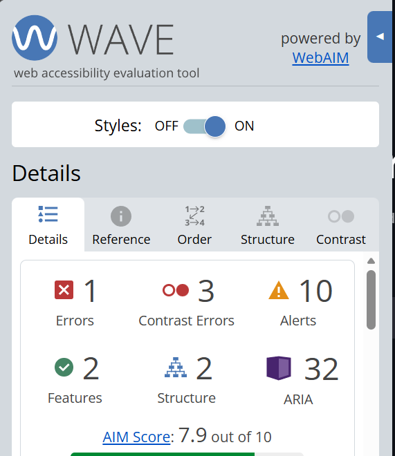

# experiments

Especially as it pertains to responsible computing, if conducting experiments or evaluations that involve particular ethical considerations, those issues should be carefully considered and documented. In this project, the primary focus of evaluation is on accessibility and accuracy, both of which relate directly to responsible computing practices. Accessibility ensures that the application can be used by a wide range of users, including those with disabilities, while accuracy ensures that the information being presented is reliable and trustworthy.

From an ethical standpoint, there are minimal risks involved in this project since it does not collect or store personal user data. However, there is still an important responsibility to ensure that the data being presented is correct and accessible. Providing inaccurate statistics could mislead users, and poor accessibility design could exclude certain groups of users from effectively using the tool. Because of this, both accessibility and accuracy testing are essential components of the experimental design.

Additionally, the evaluation process is designed to be repeatable and unbiased. By using automated tools and randomized testing methods, the results are less likely to be influenced by human bias or selective testing. This helps ensure that the conclusions drawn from the evaluation are fair and representative of the system’s actual performance.

## Accessibility

In terms of accessibility, I will be focusing on testing the website side of this project, as accessibility determines how easily a site can be navigated and used by a wide range of users. Accessibility is an important factor in modern web development, as it ensures that users with different needs, including those who rely on assistive technologies, are able to interact with the site effectively. One simple way to test this manually is by visiting a website, pressing the Tab key, and observing how effectively you can move through interactive elements such as links, buttons, and forms. This gives a basic sense of how accessible the site is for keyboard users and whether the navigation flow is logical and usable.

For this project, however, I am evaluating the accessibility of the website that hosts my search functionality in a more structured way. To do this, I used the Chrome extension called the WAVE Evaluation Tool, which analyzes web pages for accessibility issues and highlights potential problem areas. This tool provides a more detailed and systematic evaluation compared to manual testing, allowing me to identify specific issues that may not be immediately obvious. Below is a figure showing the output I obtained when I ran the tool on my website:

As seen in the figure, the site received a score of 7.9 out of 10. Ideally, this score should be as close to 10 as possible, as higher scores indicate fewer accessibility issues and a better overall user experience. In my case, the report identified three contrast errors, which relate to the color contrast used throughout the site. These errors were found in the sections menu; however, they are tied to an element that is not always present, which means they may not consistently affect all users but still represent a potential issue.

There are a few ways to address this issue. A quick but temporary fix is to click the “x” on the sections menu to remove those elements entirely. Doing this increased the WAVE Evaluation Tool score to 9.6, though this improvement is somewhat misleading since it occurs when nothing is selected and therefore does not reflect typical usage of the site. A more appropriate and permanent solution is to adjust the site’s color scheme to improve contrast. One simple way to achieve this is by using tools like Adobe Color to evaluate and refine color combinations for better accessibility, ensuring that text and background colors meet recommended contrast ratios.

Additionally, there was one error related to a missing link. This can be resolved by either removing the empty link altogether or adding descriptive text that clearly explains the link’s purpose or destination. Fixing this issue not only improves accessibility but also enhances overall usability by making navigation clearer for all users.

## Accuracy test

This project’s relation to accuracy is based on how well I am able to retrieve the correct information from the site. Ideally, my tool should return the correct data 100 percent of the time, as accuracy is essential for ensuring that users can rely on the results it provides. Any inconsistencies or incorrect data could reduce the overall effectiveness of the tool, so maintaining a high level of accuracy is a key goal of this project. Accuracy is especially important in this context because users expect statistical data to be precise and up to date.

To evaluate this, I will be randomly selecting a player from the PAC within the sport of baseball, since that is currently the only sport I am incorporating in this project, with plans to expand to additional sports in the future. Using a random selection process helps ensure that the testing is unbiased and not limited to only certain players or specific cases. This allows for a more realistic assessment of how the tool performs across a wider range of data and prevents the results from being skewed by selecting only well-known or frequently accessed players.

The testing process will involve selecting a random player, navigating to the site, and then randomly choosing a specific statistic from that player’s page. I will then compare that value to the one returned by my tool to determine whether they match. By repeating this process multiple times, I can evaluate how consistently accurate my tool is over a series of trials and identify any recurring issues or discrepancies that may need to be addressed. Running multiple trials also helps reduce the impact of any single anomaly and provides a clearer picture of overall system performance. Below is a diagram of what the test will look like in terms of paths:

Looking more in depth at the figure above, we see multiple steps to how this test works. As I briefly stated before, the test first connects to my database, and once it has successfully connected, it grabs a random player. The player can be from any team or any position, and depending on the player’s position, they will receive different stats dependent on their role, such as hitting, pitching, or fielding statistics. After the player has been selected and their random stat is chosen, the system then navigates to the website (PAC) where the stats were originally obtained and compares that stat of that player to what it currently is on the site.

This comparison step is critical, as it directly measures whether the data stored in the database matches the source data. If the values match, the test is considered a success; if they do not, it indicates a potential issue either in data collection, storage, or retrieval. The sample size is currently set to 20 tests, as this allows results to be gathered fairly quickly while still providing a reasonable indication of overall accuracy. In the future, this sample size could be increased to provide even more reliable results and a more comprehensive evaluation.

Below is the accuracy test results:

This output represents a near‑complete validation of your system’s ability to accurately retrieve and compare data between your database and the live PAC website, and there is quite a bit happening beneath the surface beyond the simple “19 out of 20 passed” summary.

The system begins by randomly going through each section of my database and from where it selects a random player. So this allows there not to be favoring one person, allowing my tool to show that this issue just isn't with one person. It shows that it works for everyone inhabiting the database. Once the player has been selected from the database, it then grabs a random stat from that player for the specific category of which it was chosen from. After this initial process the real validations begin to happen. Once all that happens, it uses that team tag to go to the site, as it fills the requirements for link to work. It scrapes this page of the site of where the stats would be, and finds the corresponding stats to test. When the test gives a “Pass” it signifies that either all the data in the database that was tested was correct or the if the percentage of test had a percent high enough to to be considered good. As the test runs it gives prompts to let you know who you are testing, this allows for real time acknowledgement that all the separate components of the test functionality are working. Moving forward I will be discussing results from this test.

The overall result of 19 passing tests out of 20 gives you a 95 percent accuracy rate, which is especially meaningful because the tests are randomized. Each run samples different players, teams, and stats, so the system is not being evaluated on a fixed or predictable set of cases. Instead, it is being challenged across a wide range of scenarios, and the fact that it performs this well under those conditions suggests that the core logic is both stable and adaptable. I update the code every two days, so that my database stays up to date with the PAC website. I have run this specific test four times and will not run it anymore. Out of the four times that I have run this test I have run it after I have updated the database. Two of which were 95% accurate and the other two were 100% accurate. Moving away from that approach, I will be running the test without updating the database. This will help me get a grasp on whether I need to have my database updated more frequently or less. On the tests that weren't 100% they were simple failures.

Although the failure was simple, the failure is just as important as the successes. A mismatch could indicate a genuine data discrepancy between your database and the live site, a scraping issue caused by unexpected HTML structure, or a name‑matching edge case where formatting or initials caused the wrong player to be selected. It could also stem from subtle formatting differences such as “.300” versus “0.300” that normalization did not fully resolve. These failures are valuable because they highlight the exact areas where refinement will have the greatest impact, and they give you a clear direction for improving long‑term reliability.

From a broader perspective, this test is functioning as a full integration test rather than a simple unit test. This test simultaneously validates database integrity, scraping correctness, HTML parsing, name matching, and stat normalization. That makes the results more realistic and more representative of real world usage, but it also means that when something goes wrong, the source of the issue can be more complex. Adding more detailed logging around each step will make it easier to pinpoint the exact cause of any future failures.

The “EXCELLENT DATA” label reflects your threshold‑based evaluation, but it also signals that your system is already performing at a level that would be considered reliable for practical use. The next phase is about consistency, scalability, and refinement rather than major architectural changes. Increasing the number of tests, monitoring patterns in the failures, and tightening the weaker parts of the pipeline will help push that 95 percent closer to 100. This is why my next test will be of similar functionality however the timing of when I run the tests will be different.

Finally, since I will be having the code update every 2 days, the validation factor comes into hand as my database is being updated to what the PAC stats are.

## Threats to Validity

There are several potential threats to validity that could impact the results of this evaluation, and it is important to consider these when interpreting the outcomes of both the accessibility and accuracy tests. One of the most significant concerns is the relatively small sample size used in the accuracy testing. While a sample size of 20 tests allows for quick feedback and a general understanding of performance, it does not fully capture the wide range of possible cases that could occur. Because the players and statistics are selected randomly, it is possible that certain edge cases or problem scenarios are not encountered during testing. Increasing the number of trials would provide a more reliable measure of accuracy and reduce the influence of randomness on the results.

Another important threat to validity is the assumption that the source website being used for comparison is always correct. The evaluation process treats the PAC website as the ground truth, meaning that any discrepancy between my tool and the site is considered an error in my system. However, if the website itself contains outdated information, delayed updates, or inconsistencies, this could lead to misleading conclusions. In such cases, a failed test may not necessarily indicate a problem with my tool, but rather an issue with the source data. This dependency on an external system introduces uncertainty that is outside of my control.

The name matching process also presents a potential source of error. Although the matching logic is designed to handle variations in formatting, such as differences in capitalization, punctuation, or the order of first and last names, it is not guaranteed to work perfectly in all situations. Players with similar names, abbreviated names, or uncommon formatting may not be matched correctly between the database and the website. This could result in false negatives where a player exists on both sources but is not recognized as the same individual, ultimately affecting the measured accuracy of the system.

Another factor that may impact validity is the limited scope of the dataset. At this stage, the project only includes baseball data from the PAC, which means that the evaluation results are specific to this particular sport and dataset. The structure, formatting, and consistency of data may differ across other sports or organizations, and the current results may not generalize well when the project is expanded. As additional sports are incorporated, new challenges may arise that were not present in the initial implementation, potentially affecting both accessibility and accuracy.

There is also a dependency on web scraping, which introduces another layer of potential issues. The scraping process relies on the structure of the website remaining consistent, including the layout of tables, element IDs, and class names. If the website undergoes any changes, such as redesigns or updates to its HTML structure, the scraping logic may break or return incorrect data. This could lead to inaccurate comparisons that are not due to issues with the database itself, but rather with how the data is being retrieved from the site.

Timing and synchronization between the database and the live website also represent a threat to validity. If the database is not updated at the same time as the website, there may be temporary mismatches between the stored data and the current data displayed online. This is especially relevant if statistics are updated frequently. In these situations, the tool may appear inaccurate even though it is correctly reflecting the data available at the time it was stored. Ensuring consistent and frequent updates to the database could help reduce this issue.

Another consideration is the randomness of the testing process itself. While random selection helps reduce bias, it also means that results may vary between test runs. One set of 20 tests may produce slightly different accuracy results compared to another set, simply due to the different players and statistics selected. This variability can make it more difficult to draw definitive conclusions from a single round of testing, further reinforcing the need for larger sample sizes and repeated evaluations.

Finally, there are potential limitations related to accessibility testing. While the WAVE Evaluation Tool provides a structured and automated way to identify accessibility issues, it may not capture all real-world usability concerns. Automated tools can detect technical issues such as contrast errors and missing labels, but they cannot fully evaluate how users interact with the site in practice. Manual testing, such as keyboard navigation and user experience evaluation, is still necessary to gain a complete understanding of accessibility. Relying too heavily on automated tools could result in overlooking certain usability challenges that affect real users.

Overall, these threats to validity highlight the importance of interpreting the evaluation results with caution. While the current testing approach provides useful insights into the performance of the system, there are several external and internal factors that could influence the outcomes. Addressing these limitations in future work, such as increasing the number of tests, improving data synchronization, refining name matching, and expanding the dataset, would help strengthen the reliability and validity of the evaluation.
