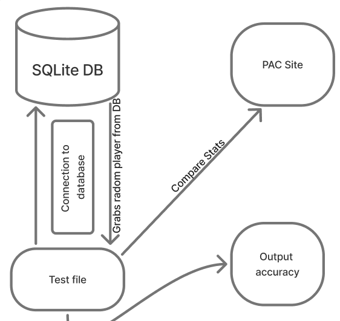
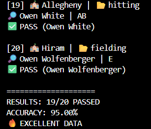

Especially as it pertains to responsible computing, if conducting experiments or evaluations that involve particular ethical considerations, those issues should be carefully considered and documented. In this project, the primary focus of evaluation is on accessibility and accuracy, both of which relate directly to responsible computing practices. Accessibility ensures that the application can be used by a wide range of users, including those with disabilities, while accuracy ensures that the information being presented is reliable and trustworthy.

From an ethical standpoint, there are minimal risks involved in this project since it does not collect or store personal user data. However, there is still an important responsibility to ensure that the data being presented is correct and accessible. Providing inaccurate statistics could mislead users, and poor accessibility design could exclude certain groups of users from effectively using the tool. Because of this, both accessibility and accuracy testing are essential components of the experimental design.

Additionally, the evaluation process is designed to be repeatable and unbiased. By using automated tools and randomized testing methods, the results are less likely to be influenced by human bias or selective testing. This helps ensure that the conclusions drawn from the evaluation are fair and representative of the system’s actual performance.

## Accessibility

In terms of accessibility, I will be focusing on testing the website side of this project, as accessibility determines how easily a site can be navigated and used by a wide range of users. Accessibility is an important factor in modern web development, as it ensures that users with different needs, including those who rely on assistive technologies, are able to interact with the site effectively. One simple way to test this manually is by visiting a website, pressing the Tab key, and observing how effectively you can move through interactive elements such as links, buttons, and forms. This gives a basic sense of how accessible the site is for keyboard users and whether the navigation flow is logical and usable.

For this project, however, I am evaluating the accessibility of the website that hosts my search functionality in a more structured way. To do this, I used the Chrome extension called the WAVE Evaluation Tool, which analyzes web pages for accessibility issues and highlights potential problem areas. This tool provides a more detailed and systematic evaluation compared to manual testing, allowing me to identify specific issues that may not be immediately obvious. Below is a figure showing the output I obtained when I ran the tool on my website:

As seen in the figure, the site received a score of 7.9 out of 10. Ideally, this score should be as close to 10 as possible, as higher scores indicate fewer accessibility issues and a better overall user experience. In my case, the report identified three contrast errors, which relate to the color contrast used throughout the site. These errors were found in the sections menu; however, they are tied to an element that is not always present, which means they may not consistently affect all users but still represent a potential issue.

There are a few ways to address this issue. A quick but temporary fix is to click the “x” on the sections menu to remove those elements entirely. Doing this increased the WAVE Evaluation Tool score to 9.6, though this improvement is somewhat misleading since it occurs when nothing is selected and therefore does not reflect typical usage of the site. A more appropriate and permanent solution is to adjust the site’s color scheme to improve contrast. One simple way to achieve this is by using tools like Adobe Color to evaluate and refine color combinations for better accessibility, ensuring that text and background colors meet recommended contrast ratios.

Additionally, there was one error related to a missing link. This can be resolved by either removing the empty link altogether or adding descriptive text that clearly explains the link’s purpose or destination. Fixing this issue not only improves accessibility but also enhances overall usability by making navigation clearer for all users.

## Accuracy test

This project’s relation to accuracy is based on how well I am able to retrieve the correct information from the site. Ideally, my tool should return the correct data 100 percent of the time, as accuracy is essential for ensuring that users can rely on the results it provides. Any inconsistencies or incorrect data could reduce the overall effectiveness of the tool, so maintaining a high level of accuracy is a key goal of this project. Accuracy is especially important in this context because users expect statistical data to be precise and up to date.

To evaluate this, I will be randomly selecting a player from the PAC within the sport of baseball, since that is currently the only sport I am incorporating, with plans to expand to additional sports in the future. Using a random selection process helps ensure that the testing is unbiased and not limited to only certain players or specific cases. This allows for a more realistic assessment of how the tool performs across a wider range of data and prevents the results from being skewed by selecting only well-known or frequently accessed players.

The testing process will involve selecting a random player, navigating to the site, and then randomly choosing a specific statistic from that player’s page. I will then compare that value to the one returned by my tool to determine whether they match. By repeating this process multiple times, I can evaluate how consistently accurate my tool is over a series of trials and identify any recurring issues or discrepancies that may need to be addressed. Running multiple trials also helps reduce the impact of any single anomaly and provides a clearer picture of overall system performance. Below is a diagram of what the test will look like in terms of paths:

Looking more in depth at the figure above, we see multiple steps to how this test works. As I briefly stated before, the test first connects to my database, and once it has successfully connected, it grabs a random player. The player can be from any team or any position, and depending on the player’s position, they will receive different stats dependent on their role, such as hitting, pitching, or fielding statistics. After the player has been selected and their random stat is chosen, the system then navigates to the website (PAC) where the stats were originally obtained and compares that stat of that player to what it currently is on the site.

This comparison step is critical, as it directly measures whether the data stored in the database matches the source data. If the values match, the test is considered a success; if they do not, it indicates a potential issue either in data collection, storage, or retrieval. The sample size is currently set to 20 tests, as this allows results to be gathered fairly quickly while still providing a reasonable indication of overall accuracy. In the future, this sample size could be increased to provide even more reliable results and a more comprehensive evaluation.

Below is the accuracy test results:

## Threats to Validity
