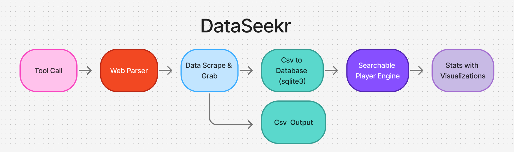
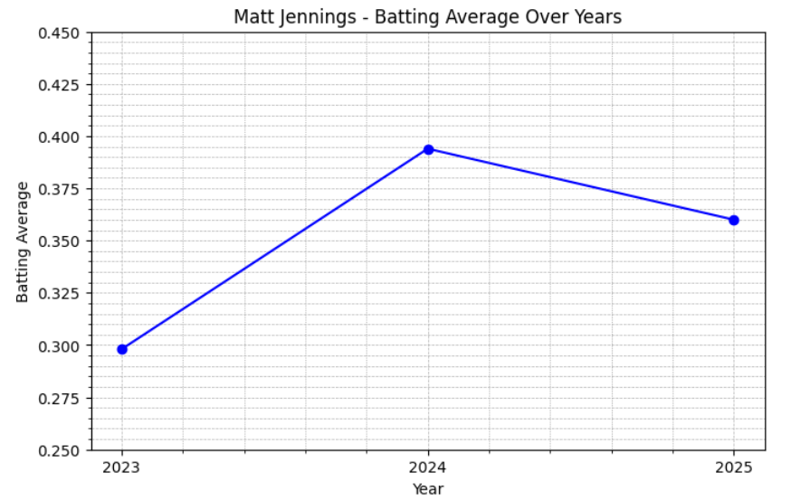

# Introduction

## What is data manipulation?

Data manipulation is the process of adjusting, organizing, or transforming data to make it more useful, meaningful, or easier to analyze. It involves reshaping raw information into a structured and interpretable form by cleaning errors, standardizing formats, combining or separating data sets, and generating new calculated values. Through these operations, data becomes better suited for analysis, decision-making, visualization, and further computational tasks. Ultimately, data manipulation enhances the accuracy, clarity, and usability of information across a wide range of applications.

## How Would That Look in Sports?

Data manipulation in sports can lead to many different possible outcomes, and it can completely change a person’s chances of getting new or any opportunities at all. When data is handled the wrong way, it can cause athletes to lose interest from scouts, lose popularity, and lose exposure. These three things are some of the most important parts an athlete needs in order to get opportunities in the first place.

When data is used the right way, though, it can actually help athletes a lot. Graphs that show a player’s projectability can keep scouts focused on you longer and keep their interest within your scope instead of drifting to someone else. This supports two out of the three main things athletes need. The reason it doesn’t fully cover popularity is because popularity is much harder to control.

Athletes in higher divisions already have cameras everywhere and often appear on television, so they gain popularity without really trying. Competing with that when you don’t have the same platform is basically a high-risk, low-reward strategy. With that in mind, it makes more sense to focus on goals that athletes can actually reach instead of trying to win a popularity battle they probably can’t win.

## My idea

The idea I came up with is to make a player search engine that gives graphs showing a player’s projectability while also providing accurate, up-to-date results. This tool focuses on the two main factors athletes can realistically improve, which are interest and exposure. By doing this, it helps keep scouts focused on the athlete they’re searching for because they can find the information they need much quicker.

Time is one of the biggest problems scouts deal with. They are always moving fast, and when they can’t find what they need right away, they usually move on to the next athlete. If you aren’t quick enough, you lose potential opportunities. Coaches and scouts deal with constant time pressure and often make fast decisions with limited information. Even something small like a late highlight video, a schedule conflict, or missing one showcase can seriously hurt an athlete’s chances [@StavrosSmithLopez2022].

My tool helps prevent this by keeping stats updated and easier to find, which cuts down the time and effort scouts normally spend searching for players. This naturally leads to more exposure, because once scouts can access your stats quickly, you enter their list instead of being overlooked. Interest and exposure build off each other, and this tool makes that process smoother.

In addition, my tool can also serve multiple purposes because of the data I collect. My tool does not just give graphs but also makes 2 CSV files (comma-separated values). How my tool works is as follows: the first step of my tool is collecting data and storing the data. I use BeautifulSoup and Selenium as my web parsers and scrapers. Their job is to create a cloned version of the site and then scrape all the information I tell it to. Then it will create 2 CSV files whose information will also be added to the database. The reason I have it making a CSV file is because I chose to make it go from CSV to database; however, the other reason it makes a CSV is that they are easy to evaluate and make changes to. This allows other companies or whoever is using my tool to input it into their own systems and make their own adjustments. This idea aligns with the growing role of data science in sports [@Previati2020].

After the CSV files are made, they are added to a database, and this is where everyone's stats will be stored. For my database, I am using SQLite due to its ease of use and reliability. When people search using my tool, they are simply querying the database, receiving the player’s stats and visualizations that show projectability while also giving insight into what a player needs to improve.

For example, when seeing someone’s batting average start to decline, they know they need to work on the hitting aspect of the game. If they are doing drills and see a decrease, they know they need to adjust what they are doing. This is more player-focused, as different drills work for different people, so it becomes a process of experimenting and refining their approach.

After all that, a model of my workflow is shown in [Figure 1]:

Figure 1 shows the workflow of the DataSeekr tool.  

While I mentioned earlier that the tool mainly covers two factors, it does help a little with popularity as well. It’s just not on the same level as athletes who get televised coverage. Those players gain popularity automatically because people already see them on TV. The athletes using my tool still need to be somewhat known ahead of time or have been seen by someone. However, using my tool will help them put their best foot forward, as coaches and scouts will see the most important information quickly and clearly.

## Tests

The tests I conducted for this experiment were straightforward but highly effective. I evaluated three key areas: time, storage, and the accuracy of the data my tool scraped and stored. First, I measured how long it took to manually gather statistics compared to using the tool I created. Next, I examined the amount of storage required, which was especially important because all information was being compiled into a single large database. Finally, I tested the accuracy of the collected data to ensure that every player’s information was captured correctly and that no entries were missing. Together, these tests helped confirm the tool’s reliability and provided a strong foundation for future development.

## Personal Motivation

My motivation for creating the tool stems from my background and interests. One main reason is that I am a collegiate athlete, and as an athlete, you are constantly looking at your stats to understand your performance. For the PAC (Presidents' Athletic Conference), finding these stats can be difficult. To address this issue, I wanted to make it easier for myself and other athletes.

Another reason is my interest in web scraping. I see it as a modern and powerful way to collect and adapt data. Lastly, baseball has been my sport since I was young, which is why I focused on a baseball-related approach for this tool.

## Professional Motivation

From a professional standpoint, this tool addresses a key issue: athletes losing opportunities due to timing and accessibility. DataSeekr reduces search time by organizing player data efficiently, especially since the PAC website does not offer a player search feature.

Unlike platforms like Hudl, which rely heavily on video highlights, DataSeekr focuses on consistent and unbiased data. Highlight videos can sometimes be misleading, as they may only show peak moments. This reinforces the pattern seen across modern sports analytics: technology can enhance performance evaluation, but access to advanced systems remains uneven and restricted to elite organizations [@Gabrisova2025].

Below is an example of the visualization output shown in [Figure 2]:

Figure 2 shows an example of player data visualization.  

## Ethical Concerns

Ethical concerns play an important role in shaping the direction and integrity of my project. Below, I outline how DataSeekr addresses these concerns. In any data-driven system, especially one that relies on automated processes, it is important to consider not only how the system functions technically, but also how it impacts users, data sources, and the broader environment. Addressing ethical concerns early helps ensure that the system remains responsible, transparent, and sustainable over time.

## Information Privacy & Data Collection

DataSeekr exclusively retrieves information that is already publicly available through the PAC website. Because of this, no privacy risks are introduced. The tool does not redistribute or commercialize the data and follows site guidelines. In addition, the system avoids collecting any personal or sensitive user data, focusing only on performance-based statistics that are intended for public viewing.

This approach reduces the likelihood of unintended privacy concerns and ensures that the system operates within acceptable ethical boundaries. By relying only on publicly accessible information, the project maintains transparency in how data is collected and used. Users are able to trace the data back to its original source, which helps build confidence in the accuracy and legitimacy of the information being presented.

## Potential Misuse & Information Accuracy

Although DataSeekr uses public data, misuse is still possible. To reduce this, the tool does not alter statistics or create subjective rankings. It simply presents data in a clearer format. This design choice minimizes the risk of bias and ensures that users are interacting with the original data rather than modified interpretations.

Accuracy depends on the PAC website. Any errors in the source will appear in the tool. Users should verify important data directly when needed. This highlights a limitation of the system, where the reliability of the output is directly tied to the reliability of the source data.

In addition, maintaining accuracy requires consistent updates and monitoring. Since the data changes frequently, delays in updating can result in outdated or incomplete information. This reinforces the importance of maintaining a regular update schedule and validating results over time to ensure that the system continues to provide reliable data.

## Second and Third Party Risks

Even public data can pose risks when reused in new contexts. To prevent misuse, DataSeekr limits data usage to internal processing and does not redistribute it. This maintains the original meaning and prevents misinterpretation [@Metcalf2019].

When data is taken out of its original context, there is a risk that it may be misunderstood or used in unintended ways. By keeping the data within the system, these risks are reduced. Additionally, restricting redistribution helps preserve the integrity of the data and ensures that it remains consistent with its original purpose.

## Goal of my Project

The goal of this project is to create a tool that promotes equality in sports, especially in recruiting and the transfer portal. It aims to eliminate missed opportunities caused by lack of access, time constraints, and inequality. Many athletes are overlooked not because of performance, but because they lack visibility or access to the right tools.

By providing fast, reliable, and clear data with visualizations, DataSeekr helps athletes gain exposure and gives coaches better tools to evaluate talent. The use of visualizations improves interpretability, allowing users to quickly understand trends and performance without requiring advanced technical knowledge.

Additionally, by relying on publicly available data, the system promotes fairness and equal opportunity. Athletes from all backgrounds are able to be represented, regardless of resources or exposure. This supports a more equitable environment where evaluation is based on performance rather than external advantages.
