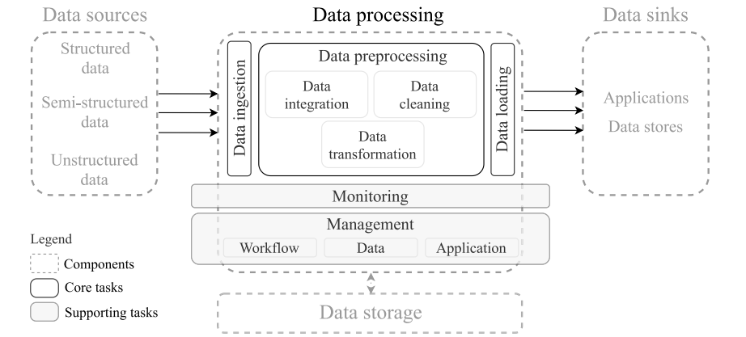

# Related work

## Data Manipulation in Analytical Systems

When people build systems that analyze large volumes of data, it is rarely enough to simply “collect and store” the data. You usually need a full pipeline that extracts raw inputs, cleans or transforms them, and then loads them into a database or analysis system. This process, often called ETL (extract-transform-load, or in modern contexts, variant pipelines), ensures that data is accurate, consistent, and in the right format for analysis. In practice, each stage of this pipeline plays a critical role in maintaining data quality. The extraction phase must correctly gather data from potentially unreliable or changing sources, the transformation phase must standardize and clean the data without introducing new errors, and the loading phase must ensure that the data is stored efficiently and correctly for future use. But recent research shows that these pipelines are often fragile and have a good amount of errors. In a large study, engineers identified 41 different factors that influence whether a data pipeline produces high-quality data, such as the variety of data sources, the complexity of transformations, mismatch of data types, and insufficient checks during cleaning and ingestion [@DataPipelineQuality2023]. These findings highlight how even small issues at any stage of the pipeline can propagate and significantly impact the final dataset.

Many of the data problems tend to happen early on, especially during the “cleaning” stage, when raw inputs are standardized, and during “ingestion/integration,” when data from different sources are combined [@DataPipelineQuality2023]. If a pipeline is not carefully designed with validation steps, schema definitions (clear rules for what fields and data types are expected), and metadata or provenance tracking (records of where each piece of data came from and how it was transformed), then errors can silently corrupt the dataset. These types of errors are particularly problematic because they may not be immediately visible, yet they can influence downstream analysis and lead to incorrect conclusions. In addition, inconsistencies introduced during early stages can make it difficult to debug or trace issues later in the pipeline, especially when dealing with large and continuously updating datasets.

Another important aspect of modern data pipelines is their need for scalability and adaptability. As data sources evolve or expand, pipelines must be able to handle new formats, additional fields, or structural changes without breaking. Systems that are rigid or lack flexibility are more likely to fail when confronted with unexpected changes in the data source. This is especially relevant in web-based data collection, where changes to website structure or content delivery methods can directly impact how data is extracted and processed.

This is why transparency plays a major concept in DataSeekr. By maintaining clear and consistent data handling practices, including well-defined schemas and documented transformations, the system reduces the likelihood of hidden errors and improves overall reliability. Transparency also allows for easier debugging and validation, as each stage of the pipeline can be inspected and verified independently. This becomes especially important when the system is updated frequently or when new data sources are introduced.

Below is a figure of a clean high-level pipeline.

Figure 3 shows a clean high-level data pipeline structure.  

For sports data, which can include traditional box score stats, lists of matches, roster databases, video metadata, wearable sensor outputs, etc., this fragility is especially concerning. The mixture of structured, semi-structured, and unstructured data means that schema mismatches, missing fields, or mistyped data are likely, and without proper pipeline safeguards, derived metrics (like “player performance” or “projectability”) risk being misleading. A system like DataSeekr that defines a stable ingestion schema, stores raw as well as transformed data, and logs transformations offers a more reliable foundation for analytics than scraping and manual manipulation.

## Sports Analytics and Athlete-Evaluation Technologies

In recent years, the field of sports analytics has grown far beyond traditional box scores and basic statistics. Modern research increasingly uses data from wearable sensors such as GPS trackers and accelerometers. These devices record detailed information about an athlete’s speed, direction of movement, impacts, and overall physical load. At the same time, computer vision techniques are being applied to sports video, where algorithms can automatically detect motions, estimate body positions, or evaluate biomechanical patterns. Together, these technologies allow analysts to study movement quality, positional behavior, fatigue levels, and even predict injuries or long-term workload changes [@AIWearables2024]. These tools are most commonly found in higher division or well-funded athletic programs because those programs have access to expensive equipment and dedicated staff. Even then, they are usually used for training and monitoring rather than for competitive evaluation or recruiting. This distinction is important because it highlights how advanced analytics are often used to improve internal team performance rather than to provide broad access to comparative evaluation tools.

In addition, the integration of these technologies has shifted the way performance is understood within sports environments. Rather than relying solely on outcome based metrics, analysts are now able to examine the processes that lead to those outcomes. For example, instead of only measuring how many hits a player records, analysts can evaluate the mechanics of the swing, reaction time, and movement efficiency leading up to that result. This deeper level of analysis provides a more comprehensive understanding of performance, but also increases the complexity of data collection and interpretation.

Machine learning and artificial intelligence methods have also become important in this space. Deep learning models can process continuous sensor signals or video frames and automatically identify specific events such as sprints, jumps, or shots. They can monitor workload, detect abnormal stress patterns, or highlight inefficient movement styles [@WearableSportsReview2024]. This creates a much richer understanding of performance than what classical statistics can offer. Instead of only measuring outcomes like total hits or shots per game, these systems can evaluate reaction times, movement efficiency, recovery behavior, or potential biomechanical risk factors. In some cases, predictive models are also used to estimate future performance trends or injury risk based on historical data. Although these technologies offer advanced insights, they are often too expensive or too complex for lower-division schools, small colleges, and community programs. This creates a gap between organizations that have access to advanced analytics and those that do not.

Even with their potential, these advanced systems still face several important limitations. Many studies in wearable or vision-based analytics rely on small groups of athletes, often tested in controlled laboratory environments. This makes it difficult to determine whether the findings apply in actual competitive situations or across different levels of play [@AIWearables2024]. In addition, there is significant variation in the hardware and methods used across different research groups. Sensors may record at different sampling rates, follow different calibration steps, or use different preprocessing techniques before the data is analyzed. As a result, findings from one study cannot always be compared to another. An acceleration pattern identified in one dataset may not mean the same thing in another dataset if the devices or cleaning methods differ [@DeepLearningAthlete2023]. These inconsistencies show the need for centralized, standardized ways to manage and interpret athletic data. Without standardization, it becomes difficult to build reliable models or draw consistent conclusions across datasets.

Because of these issues, many of the most advanced analytics remain limited to elite or well-funded sports organizations. Problems with reproducibility, generalizability, and the high cost of technical equipment prevent widespread adoption. Lower-division programs, high schools, and smaller colleges struggle to access these tools, which increases inequality in the opportunities available to athletes. This imbalance can influence recruiting decisions and limit visibility for athletes who may perform at a high level but lack access to advanced measurement tools.

A system like DataSeekr takes a slightly different approach. Instead of depending on expensive wearable technologies or specialized vision systems, it relies on publicly available information such as official game statistics and records. While it may not provide the extremely detailed biomechanical measurements that advanced hardware can offer, it excels in accessibility and fairness. Because it uses data that all athletes can obtain, regardless of budget or resources, it creates a more equitable landscape. This allows a wider range of athletes and teams to participate in data-driven evaluation and analysis without the barriers imposed by cost or equipment. Additionally, by focusing on standardized and widely available metrics, the system promotes consistency and comparability across different teams and levels of competition, which is essential for fair evaluation.

## Web Scraping and Automated Data Collection

“Web scraping” means using automated software to retrieve data from web pages, parse relevant information, and store it in a structured form (e.g. CSV, database). For sports analytics, web scraping is often an attractive way to collect publicly available statistics, game logs, roster listings, highlight video metadata, schedules, and more, especially when no official API or bulk-export feature exists. In many cases, scraping becomes the only practical method for gathering large amounts of data efficiently, since manually collecting this information would be time-consuming and prone to human error. By automating the process, systems can gather consistent datasets at scale, enabling more advanced analysis and visualization.

But scraping comes with serious ethical, legal, and technical considerations. Even if the data are public in principle, a website’s terms of service may forbid automated scraping or bulk harvesting. There are also potential copyright or database right issues, especially if the site collects and compiles data. According to recent research, as scraping becomes more widespread (for example to feed large language models or AI training sets), many site owners are tightening policies, making scraping riskier [@EthicsScraping2024]. In addition, legal interpretations of data ownership and reuse can vary depending on jurisdiction, which further complicates the use of scraped data in large-scale systems. This means that developers must carefully evaluate not only what data is accessible, but also what data is permissible to collect and use.

Beyond legal risks, scraping can impose real burdens on websites. If many bots crawl a site rapidly, it can degrade performance, cause partial outages, or trigger blocking. Ethical guidelines for responsible scraping recommend respecting rate-limits (delays between requests), obeying robots exclusion rules (robots.txt), avoiding repeated heavy access, and documenting provenance (where the data came from, when it was collected) [@EthicsScraping2024]. Following these practices helps reduce the impact on the source website while also improving the reliability of the collected data. For example, adding delays between requests ensures that pages fully load and reduces the likelihood of incomplete or corrupted data being captured.

There are also technical challenges associated with scraping dynamic websites. Many modern sites rely heavily on JavaScript to load content, meaning that traditional scraping methods may fail to capture the necessary data. This requires the use of more advanced tools, such as browser automation frameworks, to fully render pages before extraction. Additionally, changes in website structure, such as updates to HTML tags or page layouts, can break scraping scripts and require ongoing maintenance. This highlights the importance of designing scraping systems that are adaptable and resilient to change.

For DataSeekr, building a scraping-based ingestion system means embedding these ethical and legal safeguards. By limiting collection to publicly available data, avoiding redistribution of copyrighted content, documenting provenance, and respecting site load, you reduce legal and ethical risk. Additionally, incorporating delays and monitoring mechanisms helps ensure that the scraping process remains stable and does not negatively impact the source website. This approach aligns with best practices in responsible computing and supports long-term sustainability of the system.

That makes your system far more defensible than a “scrape first, ask forgiveness later” approach. By prioritizing transparency, responsibility, and reliability, DataSeekr establishes a foundation that not only supports accurate data collection but also maintains ethical integrity. This is especially important as scraping becomes more common in data-driven applications, where responsible practices play a key role in ensuring trust and long-term usability.

## Limitations of Existing Athlete Platforms

Many existing athlete platforms provide helpful tools such as highlight video hosting, recruiting profiles, and analytics dashboards. These platforms can be useful for players, coaches, and scouts because they allow athletes to share their performance and communicate with teams. In many cases, they serve as a centralized location where athletes can present their achievements, statistics, and media in a way that is easily accessible to recruiters. This can streamline parts of the recruiting process and reduce the need for in-person scouting in early stages. However, even though these systems offer valuable features, they also contain problems that make them less fair and less effective for discovering talent across all levels of competition. These limitations often become more apparent when comparing athletes from different levels of exposure and access to resources.

One of the biggest challenges is something known as data lock in. This means that once an athlete uploads their videos or statistics to a specific platform, it becomes very difficult to move that information anywhere else. Some platforms do not allow exporting data at all, and others charge high prices for features that should be basic, such as downloading your own clips in high quality. This creates a dependency on a single platform, where athletes are forced to remain within that ecosystem in order to maintain visibility. Over time, this can limit flexibility and reduce an athlete’s ability to present their data across multiple platforms or opportunities. It also raises concerns about long term ownership of personal performance data, since athletes may not have full control over how their own information is stored or shared.

Another issue is the difference in visibility between large, well funded programs and smaller schools. Athletes at major universities often appear on television, have dedicated camera crews, and receive high quality highlights automatically, while smaller schools do not have this advantage. As a result, athletes from smaller programs may struggle to gain attention even if their performance is comparable or superior. This imbalance creates a bias toward athletes who are already in more visible environments, reinforcing existing inequalities within the recruiting process. In many cases, exposure becomes just as important as performance, which can disadvantage athletes who lack access to media coverage or institutional support.

A third problem is the use of closed or proprietary evaluation systems. Some platforms give athletes a “player grade” or a “projectability score,” but they do not explain how these numbers were created. Without transparency, these ratings cannot be verified or trusted. This lack of explanation makes it difficult for athletes and coaches to understand what factors are being measured or how improvements can be made. Additionally, it introduces the possibility of bias or inconsistency within the evaluation process, since users cannot independently validate the methodology behind the scores. In a data driven environment, the absence of transparency reduces the overall credibility of the system.

Another limitation is the financial barrier associated with many of these platforms. Some services require subscription fees for increased visibility, advanced analytics, or additional features. This creates a pay to access model where athletes who can afford these services gain an advantage over those who cannot. Over time, this can widen the gap between well funded programs and under resourced athletes, further contributing to inequality within the system. Access to opportunity becomes partially dependent on financial resources rather than purely on performance.

Because of these limitations, many strong athletes remain overlooked simply because they lack access to high quality video, expensive subscriptions, or the right platform. This results in missed opportunities for both athletes and recruiters, as talented individuals may not be properly represented within existing systems. DataSeekr aims to reduce this inequality by using publicly available data and presenting it in a clear and consistent format. By focusing on accessibility and transparency, the system provides a more equitable approach to evaluating performance, allowing a wider range of athletes to be considered based on objective data rather than external factors such as visibility or financial resources.

## Gaps in Current Research and How DataSeekr Contributes

Even though sports analytics, data pipelines, and automated evaluation tools have grown quickly in recent years, there are still major gaps that make it hard to work with data in a consistent and fair way. One major issue is the lack of standardization across data sources, making comparison and integration difficult. Different platforms often store and present data in different formats, use different naming conventions, or track slightly different metrics. This inconsistency creates challenges when attempting to combine datasets or perform cross-platform analysis. As a result, even when large amounts of data are available, the lack of standardization reduces its overall usefulness and limits the ability to draw meaningful comparisons.

Another gap is the lack of long-term data pipelines. Many systems collect data once and do not maintain updates, leading to outdated or inconsistent information. Without continuous data ingestion and updating, datasets quickly lose relevance, especially in domains like sports where performance changes frequently. A system that does not account for ongoing updates risks providing inaccurate insights over time. This highlights the importance of designing pipelines that are not only capable of collecting data, but also maintaining it in a consistent and reliable manner over extended periods.

There are also ethical concerns, particularly around scraping without transparency or permission, which can introduce legal risks [@Akinwande2024ScrapingEthics]. In addition to legal implications, a lack of transparency in data collection can reduce trust in the system itself. Users may not know where the data originates, how often it is updated, or whether it has been modified during processing. Responsible data practices require clear documentation of data sources, adherence to terms of service, and consideration of the impact that automated data collection may have on the source platforms.

Another important gap relates to accessibility and usability of existing systems. Even when data is available, it is often difficult for users to interact with it in a meaningful way. Complex interfaces, limited search capabilities, and lack of visualization tools can make it challenging for users to extract insights. This limits the practical value of the data, especially for users who may not have technical expertise in data analysis. Improving accessibility requires not only making data available, but also presenting it in a way that is intuitive and easy to interpret.

DataSeekr addresses these gaps by using a transparent pipeline (scraping → CSV → database → visualization), standardized schema design, and publicly available data. This improves accessibility, reproducibility, and fairness. By maintaining a consistent data structure and updating the dataset regularly, the system reduces inconsistencies and ensures that information remains current. Additionally, the use of publicly available data helps promote fairness by removing barriers related to cost or access. The transparency of the pipeline also allows users to better understand how the data is collected and processed, increasing trust in the system. Overall, this approach provides a more reliable and equitable framework for working with sports data.
